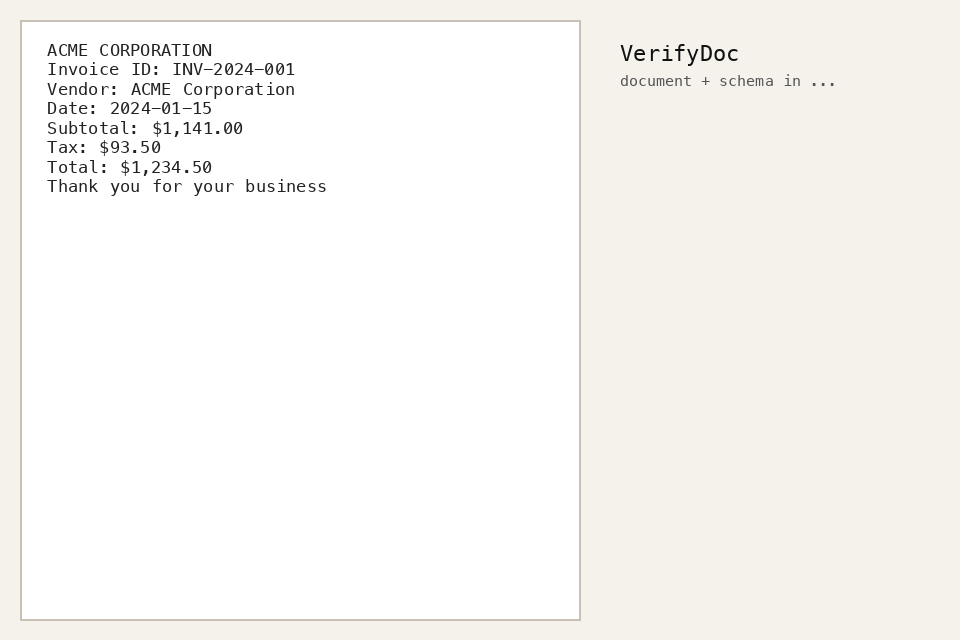

# VerifyDoc

> **The trust layer for document → structured-JSON extraction.** Wrap any extractor — get back JSON where **every field** carries a **calibrated confidence**, a **source grounding** (page + bbox / char span), and an **accept/review decision** tuned to your error budget.

[](https://github.com/bhaskargurram-ai/verifydoc/actions/workflows/ci.yml)
[](LICENSE)
[](pyproject.toml)
[](https://github.com/psf/black)



*Above: a real pipeline run (`scripts/make_demo_gif.py`). The extractor returned `$1,432.50`; the page says `$1,234.50`. Grounding support drops to 0.78, the field misses the accept threshold, and the reviewer is pointed at the exact source region. The other three fields are auto-accepted.*

## The problem

Modern document parsers read pages at 96%+ benchmark accuracy — and still emit **fluent, plausible, silently-wrong values** (`$42.50` → `$45.20`) with **no reliable per-field signal telling you which values to trust**. Commercial APIs (Box, Azure, Textract) sell field-level confidence as a closed feature. No popular open-source parser leads with it. ([full USP audit](docs/USP.md))

VerifyDoc doesn't compete with the parsers — it **layers on top of any of them**:

```
document + schema ─► ingest ─► extractor adapter ─► confidence ─► calibration
                                (any model)          signals       (fit on cal split)
                     ─► grounding ─► abstention policy ─► verified JSON + review UI
                        (bbox/span)   (target risk α)
```

At a chosen operating point, VerifyDoc auto-accepts as many fields as possible while holding the error rate among accepted fields below your target (e.g. ≤ 2%) — everything else is routed to `review` **with its source location attached**, so a human verifies in seconds instead of eyeballing every field.

## Quickstart

```bash
pip install verifydoc          # core (text pipelines + eval harness)
pip install 'verifydoc[pdf]'   # + PDF/image ingestion
```

```python
from verifydoc import verify

result = verify("invoice.txt", schema="invoice_schema.json", k=3)
for f in result.fields:
    print(f"{f.path:12} = {f.value!r:24} conf={f.confidence:.2f} {f.decision}")
    if f.grounding:
        print(f"             └─ page {f.grounding.page}, bbox {f.grounding.bbox}")
```

```bash
verifydoc extract invoice.txt --schema invoice_schema.json --k 3 --threshold 0.8
streamlit run ui/streamlit_app.py     # review UI: green/red fields + click-through to source
```

Schemas are plain JSON Schema, with each leaf optionally declaring **how it is scored** (the executable-schema pattern):

```json
{
  "type": "object",
  "properties": {
    "invoice_id": {"type": "string"},
    "vendor":     {"type": "string", "x-scoring": "semantic"},
    "total":      {"type": "number", "x-numeric-tol": 0.01}
  }
}
```

## What's inside

| Layer | Modules | Status |
|---|---|---|
| **Adapters** (all model code isolated here) | mock · text-search · PaddleOCR-VL · dots.ocr · Docling/MinerU output · API-VLM | ✅ |
| **Confidence signals** | token-prob · verbalized · consensus (k-sample voting) · grounding-based · combined | ✅ |
| **Calibrators** (fit on a dedicated split, never test) | temperature · Platt · isotonic · histogram · **split conformal** with finite-sample risk guarantee | ✅ |
| **Grounding** | value → page/bbox/char-span attachment with support scores | ✅ |
| **Policy** | empirical & conformal accept thresholds for a target selective risk | ✅ |
| **Eval harness / VerifyDocBench scorer** | Field-F1 · exact · CER/WER · ANLS · TEDS/TEDS-Struct · GriTS · omission vs hallucination · ECE/Adaptive-ECE/MCE/Brier/NLL/TCE · RC/AURC/E-AURC/Coverage@Risk/AUROC/AUPR/FPR@95 · box IoU/span-F1/grounding-conditioned correctness · bootstrap CIs + paired tests | ✅ |

Every metric implements the exact definition in [PROJECT.md §5](PROJECT.md) with a hand-computed numeric regression test (200 tests, `eval/` coverage 98%).

## The benchmark

```bash
make results     # regenerates every table/figure in paper/generated from configs/
```

The harness runs **signals × calibrators × the full metric suite** with a
document-level calibration split (disjointness asserted in code), bootstrap
CIs, and a conformal-guarantee row. The repo ships a deterministic synthetic
slice that runs in CI; loaders for CORD (and next: FUNSD, SROIE, DocILE,
XFUND) extend it. Sample findings on the shipped slice
([tables](paper/generated)):

- **Verbalized self-confidence is badly miscalibrated** (the extractor says ~0.9 regardless of correctness) — exactly the failure mode reported for RLHF'd models.
- **Consensus and grounding signals rank errors near-perfectly** (AUROC ≈ 0.98): corrupted values can't be traced back to the page, so grounding support collapses.
- **The conformal row holds its guarantee** on every tested α, and reports the abstention it forces.

These self-checks run as unit tests — the repo's core claims are CI-enforced, not just stated.

## Why not just use the parser's own score?

Because it doesn't exist (Docling/MinerU/Marker), or it's a raw recognition
score that was never calibrated against field-level correctness
(PaddleOCR/dots.ocr). See [docs/USP.md](docs/USP.md) for the audit, and the
reliability diagrams in `paper/generated/` for what "calibrated" actually
buys you.

## Roadmap

- [x] v0.1 — library + CLI + harness + synthetic benchmark slice + UI
- [ ] CORD/FUNSD/SROIE slices with gold source boxes (VerifyDocBench v1)
- [ ] Learned signal combiner + per-field-type calibration
- [ ] Paper: first systematic study of confidence signals × calibration × abstention for document extraction

## Development

```bash
git clone https://github.com/bhaskargurram-ai/verifydoc && cd verifydoc
uv venv .venv && uv pip install -e ".[dev]"
make test lint typecheck     # all green before any PR (CI enforces)
```

Contributions welcome — see the issues tagged `good-first-issue`. All model-specific code goes in `verifydoc/adapters/`; a new extractor is one file.

## Citation

```bibtex
@software{verifydoc2026,
  author = {Gurram, Bhaskar},
  title  = {VerifyDoc: Calibrated, Abstaining, Grounded Document Extraction},
  year   = {2026},
  url    = {https://github.com/bhaskargurram-ai/verifydoc}
}
```

Apache-2.0.
